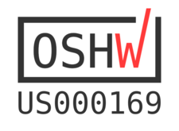

# BeagleBoard.org BeagleBone AI
_Fast track to Embedded Artificial Intelligence_

[BeagleBone AI](https://beagleboard.org/ai) is built on the proven BeagleBoard.org® open source Linux approach, BeagleBone® AI has the form-factor of a miniature single-board computer (SBC) with the power of a full-on industrial computer workhorse. Based on the Texas Instruments AM5729, developers have access to the powerful SoC with the ease of BeagleBone® Black header and mechanical compatibility. BeagleBone® AI makes it easy to explore how artificial intelligence (AI) can be used in everyday life via the TI C66x digital-signal-processor (DSP) cores and embedded-vision-engine (EVE) cores supported through an optimized TIDL machine learning OpenCL API with pre-installed tools. Focused on everyday automation in industrial, commercial and home applications.

# Terms
These design materials are *NOT SUPPORTED* and *DO NOT* constitute a reference design. Only “community” support is allowed via resources at [BeagleBoard.org/discuss](https://beagleboard.org/discuss).

THERE IS NO WARRANTY FOR THE DESIGN MATERIALS, TO THE EXTENT PERMITTED BY APPLICABLE LAW. EXCEPT WHEN OTHERWISE STATED IN WRITING THE COPYRIGHT HOLDERS AND/OR OTHER PARTIES PROVIDE THE DESIGN MATERIALS “AS IS” WITHOUT WARRANTY OF ANY KIND, EITHER EXPRESSED OR IMPLIED, INCLUDING, BUT NOT LIMITED TO, THE IMPLIED WARRANTIES OF MERCHANTABILITY AND FITNESS FOR A PARTICULAR PURPOSE. THE ENTIRE RISK AS TO THE QUALITY AND PERFORMANCE OF THE DESIGN MATERIALS IS WITH YOU. SHOULD THE DESIGN MATERIALS PROVE DEFECTIVE, YOU ASSUME THE COST OF ALL NECESSARY SERVICING, REPAIR OR CORRECTION.

In other words, you may use the design materials as you choose and there is no license with regards to usage in the manufacturing process. We mean it, these design materials may be totally unsuitable for any purposes. Don't blame us!

As a general rule, we don't encourage use of this or other off-the-shelf single board computers in commercial products without engaging with a manufacturer to create a supplier agreement and make sure that you can get material as your business demands. Further, we do update the design on occasions where we find it necessary and won't guarantee a supply of older revisions, though we do seek periodic manufacturing of all of our boards for a period of roughly 10 years and will make design changes to replace obsolete parts and that may impact your usage. If you do opt to use it in a product, you take full responsibility for that product.

Do not use the BeagleBoard.org logo or trademarks (such as BeagleBoard, BeagleBone and PocketBeagle) on your products without a [logo license](https://beagleboard.org/logo) from the BeagleBoard.org Foundation, but feel free to reference BeagleBoard.org.

See the [LICENSE](https://github.com/beagleboard/beaglebone-ai/blob/master/LICENSE) file regarding the copyright of these materials.
